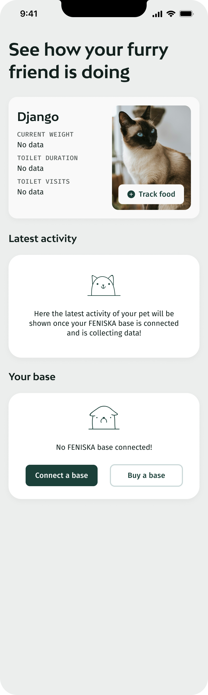

# FENISKA Coding Challenge - Frontend

## Context

Cat ownership is delightful but comes with its challenges, especially in monitoring the health and activity of the pets. To enhance the experience for cat owners, there's a need for a mobile application that not only tracks multiple cats but also integrates with IoT devices that monitor their activities, such as litterbox visits.

## Product Requirements

As a cat owner:

- [ ] I want to view the list of cats i have added to my profile on the homescreen.
- [ ] I want to view navigate to the insights page for each pet by clicking on the pet cards.
- [ ] I want to see the latest activities of each cat.
- [ ] I want to see a list of Feniska bases connected to my profile.
- [ ] I want to navigate to base detail screen when clicking on the card.
- [ ] I want to calibrate the base when clicking on the calibrate button.
- [ ] I want to know if my pets are doing ok
- [ ] I want to know my pet’s key health indicators (weight, toilet visits, toilet duration)
- [ ] I want to know if any of the health indicators are off
- [ ] I want to know if the device is connected
- [ ] I want to know how’s the wifi connection
- [ ] I want to know the latest events tracked by the devices
- [ ] I want to know the connectivity status of each bases
- [ ] I want to calibrate the bases in the base detail screen

## Your Mission

Create a React Native application using Expo and the [Ignite boilerplate](<(https://github.com/infinitered/ignite?tab=readme-ov-file)>), which incorporates MobX-State-Tree for state management. The app should fulfill all product requirements listed above.

## Tech Requirements

- React Native
- Expo
- MobX-State-Tree for state management
- Typescript (highly recommended for better maintainability)

## Instructions

Prerequisites:

You'll need at least a recent version of [Node](https://nodejs.org/en) to run the CLI
For compiling/running in a simulator, make sure you're set up for React Native by following [the official documentation](https://reactnative.dev/docs/environment-setup).

1. **Environment Setup**

   - Clone the [react native boilerplate starter](https://github.com/infinitered/ignite?tab=readme-ov-file).
   - Install necessary dependencies: `npm install` or `yarn install`.
   - Start the development server: `expo start`.

2. **Development Process**

   - Implement the UI based on provided Figma files.
   - Utilize MobX-State-Tree for managing state across the app.
   - Mock data where data is needed, such as list of pets, list of bases, etc.
   - Frequently commit changes to demonstrate progress.

3. **Review and Feedback**
   - Submit a link to your respository or send us a zip for code review.
   - Document any issues or challenges faced during development.

## Layouts and Design

Please refer to the following wireframes for the basic design. Feel free to enhance and iterate on these designs:

[Link to Figma](https://www.figma.com/file/Ek0Sr8rjh1SbBHIchJBhpV/FENISKA-App-Coding-Challenge?type=design&node-id=0%3A1&mode=design&t=we5Bf7OdacFRB5cz-1)

|          Home - Empty Screen           |           Home - 2 Pets and 2 Bases           |              Pet Detail               |              Base Detail               |
| :------------------------------------: | :-------------------------------------------: | :-----------------------------------: | :------------------------------------: |
|  |  |  |  |

## Submission Guidelines

- Ensure your code is well-documented and follows clean code practices.
- Push your repository to GitHub and provide the link, or send us a zip file of the project.
- Complete your solution within 7 days of receiving this challenge and notify us when it is ready for review.

Feel free to use modern features of React Native and JavaScript, as you're not required to support legacy systems.
